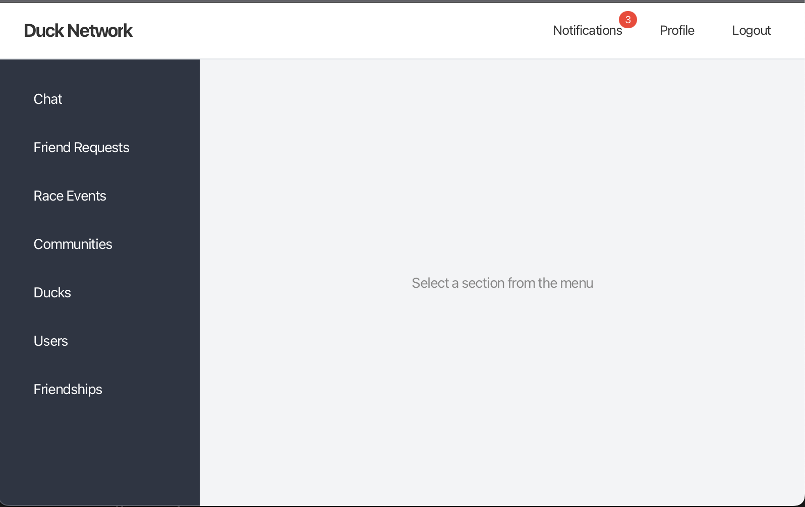

# Duck Social Network

A desktop social networking application developed using JavaFX and PostgreSQL, featuring real-time interaction capabilities through multithreading. The application supports concurrent user actions such as live messaging and dynamic friend request updates across multiple active sessions.

---

## Preview
### Home


--- 

## Overview

Duck Social Network is a full-stack desktop application that replicates core social platform functionalities. It enables users to communicate, manage friendships, and participate in events, while emphasizing concurrent processing and responsive UI updates.

A key aspect of the application is its ability to simulate real-time interactions by using background threads, allowing multiple application instances to stay synchronized.

---

## Key Features

- User management and profile visualization
- Real-time one-to-one messaging (chat updates across multiple open windows)
- Friendship system with live request handling
- Event creation and participation
- Community browsing
- Notification system
- Support for multiple entity types

---

## Real-Time Functionality

The application supports live interaction between multiple running instances, achieved through multithreading:

- Messages sent from one instance are reflected in another without restarting the application
- Friend requests and updates propagate dynamically
- Background threads periodically check for updates from the database
- UI is updated safely using JavaFX thread mechanisms

This allows the simulation of a real-time chat system in a desktop environment without WebSockets.

---

## Architecture

The project follows a layered architecture:

```
src/main/java/
├── app/
├── db/
├── domain/
├── repository/
├── service/
├── ui/
├── utils/
└── validation/
```

### Design Patterns

- Repository Pattern
- Service Layer Pattern
- MVC (Model-View-Controller)
- Observer Pattern
- Concurrent background processing (threads for polling updates)

---

## Technologies

- Java 21
- JavaFX
- PostgreSQL
- JDBC
- Gradle

---

## Database Configuration

```java
URL = "jdbc:postgresql://localhost:5432/ducknetwork";
USER = "postgres";
PASSWORD = "admin";
```

File:

```
db/DatabaseManager.java
```
Setup and Run

```
git clone https://github.com/andramates/duck-social-network.git
cd duck-social-network
./gradlew run
```
## Key Components

DatabaseManager.java – database connection

MainFX.java – application entry point

JavaFX controllers – UI logic

FXML files – layout definitions

## Author

Andra Mateș